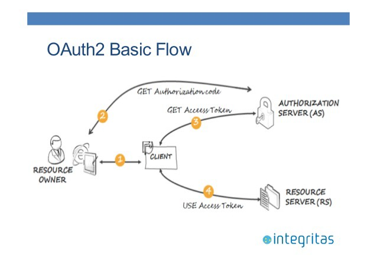

# OAuth

Данный стандарт имеет три воплощения: 1.0, 1.0a и 2.0. Наиболее актуальный и рекомендуемый выпуск - OAuth 2.0.

<i>OAuth</i> (это сокращение от выражения открытая авторизация) представляет собой стандарт авторизации в Интернете на основе токенов. Они сокращают промежуток времени открытости имен пользователей и паролей.

OAuth является протоколом авторизации (отвечая на вопрос "Что разрешено пользователю?"), а не протоколом <i>Аутенфикации</i> (который отвечает на вопрос "Кто этот пользователь?")

OAuth предоставляет клиентам "защищенный делегированный доступ" к сервисам от имени владельца данных, доступных на сервисе. После аутенфикации для авторизации запросов клиенты применяют токены. Для каждого клиента используется свой токен.

### Немного терминологии в OAuth

**<i>Клиент</i>**: приложение, выполняющее защищенные запросы. Зачастую, но не всегда, клиент делает запросы от имени конечного пользователя. Это может быть iPhone или Android приложение, бразуерный клиент HTML5 и даже часы!

**<i>Владелец ресурса</i>**: обычно этот термин относится к конечному пользователю (Куприянов Артур, Колоколов Артем, Кульбако Артемий), который может предоставить клиенту разрешение на доступ к своей информации.

**<i>Сервер русерса</i>**: сервер, на котором находится защищенный ресурс, способный прнимать защищенные запросы, содержащие токены, и отвечать на них. Этот термин имеет отношение к защищенному API, с которым клиент пытается наладить связь.

**<i>Сервер авторизации</i>**: сервер, выдающий токен доступа клиенту после успешной авторизации.

  

<i>Печатает текст...</i>

  

## Литераура

<i>Джош Лонг, Кеннет Бастани :</i> **"Java в облаке"**