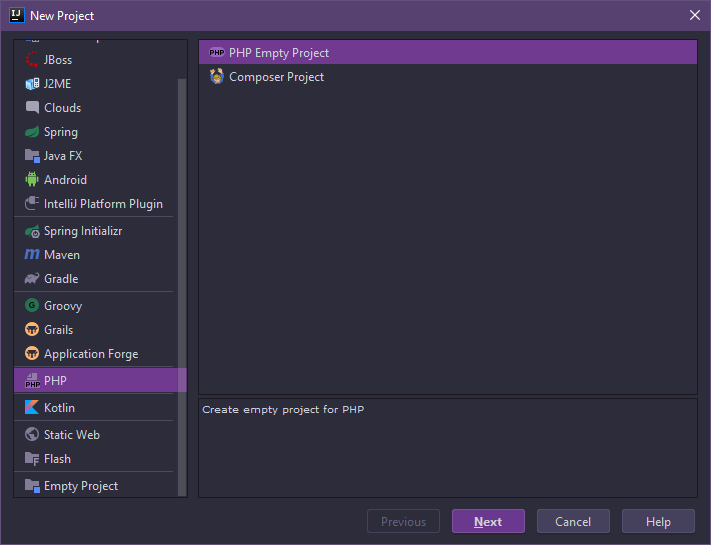
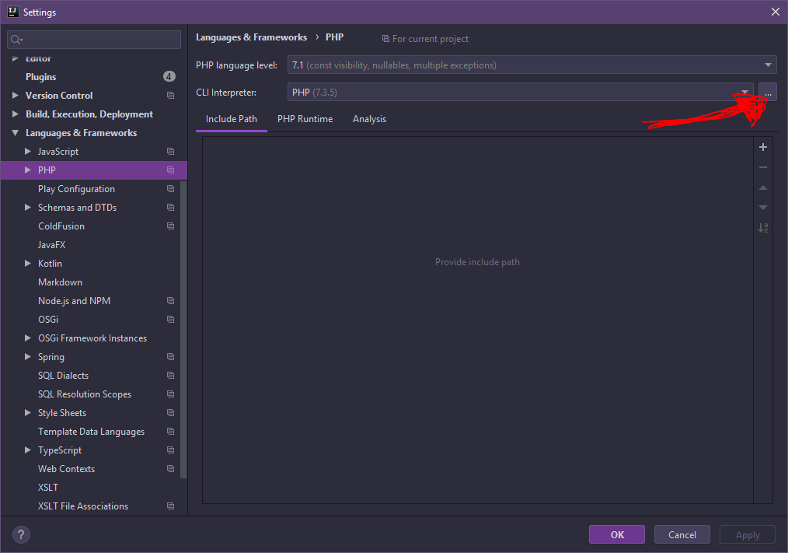
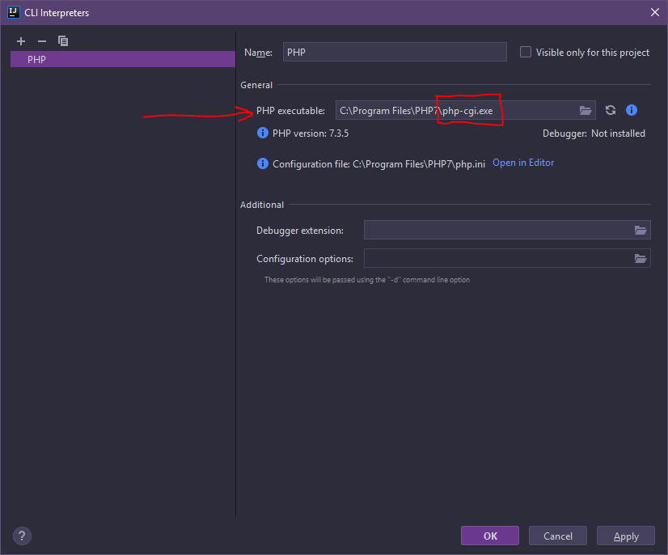
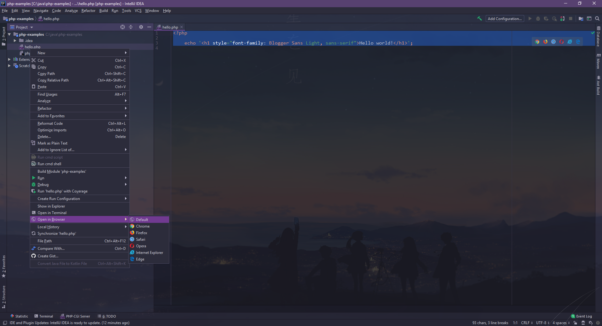

# Установка PHP в IDEA

1. Скачиваем PHP движок с [Aprelium](https://aprelium.com/downloads/)
2. Самая типичная установка, правда нужно запомнить куда вы его устанавливаете, так как нужно указать путь к исполняемому оттуда файлу (php-cgi.exe).
3. Создаем PHP Project в IDEA

4. Заходим Menu -> File -> Settings... -> Languages & Frameworks -> PHP.Нажимаем троеточие в CLI Interpreter

5. Вставляем путь к исполняемому файлу _php-cgi.exe_. Например, _C:\Program Files\PHP7\php-cgi.exe_


## Hi, World!

Создаем файл hello.php и пишем любой сценарий. Например:
```php
<?php

    echo '<h1 style="font-family: Blogger Sans Light, sans-serif">Hello world!</h1>';

```

Запускаем его через IDEA :<br>

